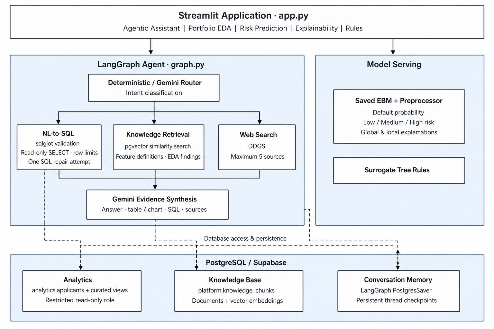

# NeoStats Credit Risk Intelligence Platform

A demo-ready, glass-box credit risk assessment and conversational analytics platform powered by **Explainable Boosting Machines (EBM)**, **PostgreSQL analytics with pgvector**, **LangGraph agentic state machines**, and **Gemini 3.5 Flash-Lite / 3.8 Flash**.

---

## Executive Summary

The **NeoStats Credit Risk Platform** demonstrates the trade-off between predictive accuracy and transparent model governance. Using the canonical Home Credit Default Risk dataset (307,511 applicants), it combines a calibrated glass-box model, applicant-level explanations, and real-time conversational analytics with SQL safety guardrails. It is a decision-support demonstration, not a validated automated lending policy or legal-compliance determination.



---

## Key Measured Machine Learning Snapshot

Models were trained and evaluated on an untouched, stratified test split (70% train, 15% validation, 15% test):

| Model | ROC-AUC | PR-AUC | Brier Score | Governance Role |
|---|---:|---:|---:|---|
| **Logistic Regression** | 0.759 | 0.238 | 0.199 | Interpretable baseline floor |
| **LightGBM (Shadow)** | 0.778 | 0.265 | 0.174 | Shadow ceiling & feature pruner (top 30 features) |
| **Calibrated EBM (Production)** | **0.764** | **0.250** | **0.068** | **Production model with glass-box additivity** |

### Internal Risk Band Calibration
Internal model-estimated payment-difficulty risk bands were calibrated on validation score percentiles and confirmed on the untouched test set:
- **Low Risk (< P60 / < 6.49%)**: 3.3% observed default rate (60.3% of applicants)
- **Medium Risk (P60 - P85 / 6.49% - 15.79%)**: 9.8% observed default rate (24.7% of applicants)
- **High Risk (>= P85 / >= 15.79%)**: 24.3% observed default rate (15.0% of applicants, capturing 45.2% of all defaults)

---

## 6 Confirmed Canonical EDA Findings

1. **Portfolio Class Imbalance (8.07%)**: An 11.4:1 ratio of non-default to default applicants across 307,511 records. Metric governance must reject raw accuracy in favor of ROC-AUC, PR-AUC, and calibration.
2. **Age Cohort Risk (20-29 Peak at 11.4%)**: Young applicants show the highest observed default rate (11.4% vs 8.1% portfolio average). This is an association, and age-derived fields are excluded from the surrogate policy rules.
3. **Rented Housing Lift (1.53x)**: Living in rented apartments is associated with a 12.3% default rate (1.53x baseline lift).
4. **Affordability Superiority**: Credit-to-income and annuity-to-income ratios separate distressed borrowers far more distinctly than raw loan or income totals.
5. **EXT_SOURCE_3 Dominance**: The third-party bureau score `EXT_SOURCE_3` is the single most predictive feature across the entire portfolio.
6. **Repayment History Signal**: Historical bureau overdues (19.8% default) and loan application refusals (11.9% default) provide far stronger risk signals than demographic characteristics.

---

## Agentic Chatbot & SQL Safety Architecture

The conversational assistant utilizes a **LangGraph StateGraph** orchestrated with **Gemini**:

### The Three Tools:
1. `query_database`: Executes validated, read-only analytics queries against curated views (`analytics.portfolio_summary`, `analytics.age_band_summary`, etc.) with row limits (200 rows) and an 8000ms statement timeout.
2. `search_knowledge_base`: Retrieves official column definitions, confirmed EDA findings, EBM model architecture rationale, and surrogate rules from `platform.knowledge_chunks` using deterministic local 768-dimensional embeddings and pgvector cosine similarity.
3. `search_web`: Uses DuckDuckGo search (`ddgs`) for general external credit risk definitions, returning up to 5 sourced results with URLs. Blocks inquiries into internal portfolio records.

### Multi-Layered SQL Safety:
- **AST Parsing with `sqlglot`**: Rejects all DDL (`DROP`, `ALTER`), DML (`DELETE`, `UPDATE`, `INSERT`), multiple statements, comments (`--`, `/* */`), queries without an approved analytics object, and functions outside a positive allowlist.
- **Strict Table Whitelist**: Only permits queries against approved `analytics.*` tables/views. Access to `raw.*`, `platform.*`, or PostgreSQL system catalogs is blocked.
- **Single Repair Loop**: Automatically passes syntax errors back to the model for one repair attempt if a query fails.
- **Postgres Checkpointing**: Uses `langgraph-checkpoint-postgres` (`PostgresSaver`) to persist chat session threads across browser refreshes.

---

## Streamlit 5-Tab Application

The user interface follows a modern dark navy styling inspired by institutional financial analytics dashboards:

1. **Agentic Assistant**: The landing tab provides responsive chat, suggested queries, tool badges, expandable SQL, result previews, citations, and PostgreSQL-backed refresh persistence.
2. **Portfolio EDA**: Precomputed high-level metrics, age cohort risk curves, housing type segment lift, and repayment history comparisons.
3. **Risk Prediction**: Real-time scoring using the production EBM bundle with preset archetypes, custom parameter controls, a 0-1000 score gauge, and internal Low/Medium/High risk bands.
4. **Explainability**: Global EBM feature importance, applicant-level additive contributions, and a LightGBM SHAP comparison. These are governance aids, not automatically validated customer-facing reason codes.
5. **Surrogate Rules**: Transparent depth-4 decision-tree approximations (Validation R² 0.525, Agreement 68.0%) presented as explanatory risk segments rather than approval or decline policy.

---

## Quickstart & Docker Execution

### One-Command Startup (Docker Compose)
Ensure Docker is running, then launch the platform:
```bash
docker compose up --build -d
```
- Streamlit Application: `http://localhost:8501`
- PostgreSQL Analytics: `localhost:5432` (User: `credit_app`, Database: `credit_risk`)

### Local Conda Development
```bash
# Activate environment
conda activate NeoStatsCredit

# Ensure environment variables are loaded
cp .env.example .env

# Verify database connection
python -m scripts.verify_postgres

# Run the test suite
python -m pytest tests/

# Launch Streamlit app
streamlit run app.py
```

---

## Test Suite Summary

All 33 automated unit and integration tests pass:
- **Database & Data Layer Tests** (4 tests): Applicant grain preservation, duplicate rejection, role access controls.
- **Evaluation & Preprocessor Tests** (4 tests): Feature engineering, risk band monotonicity, evaluation metrics.
- **SQL Safety & AST Tests**: DDL/DML rejection, comment blocking, schema restriction, positive function allowlisting, system introspection blocking, and LIMIT clamping.
- **Chatbot Gold Questions Integration Tests**: Automated verification of canonical questions, all three tools, persisted follow-up context, knowledge retrieval, and destructive-query blocking.
